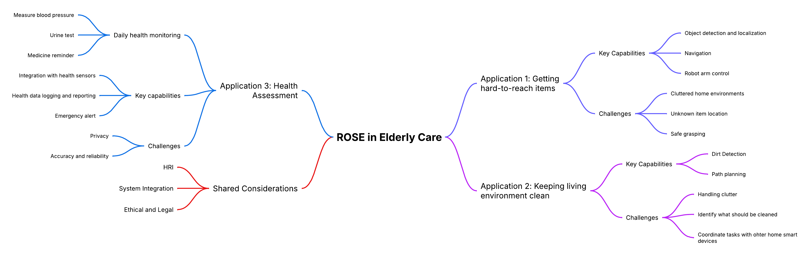
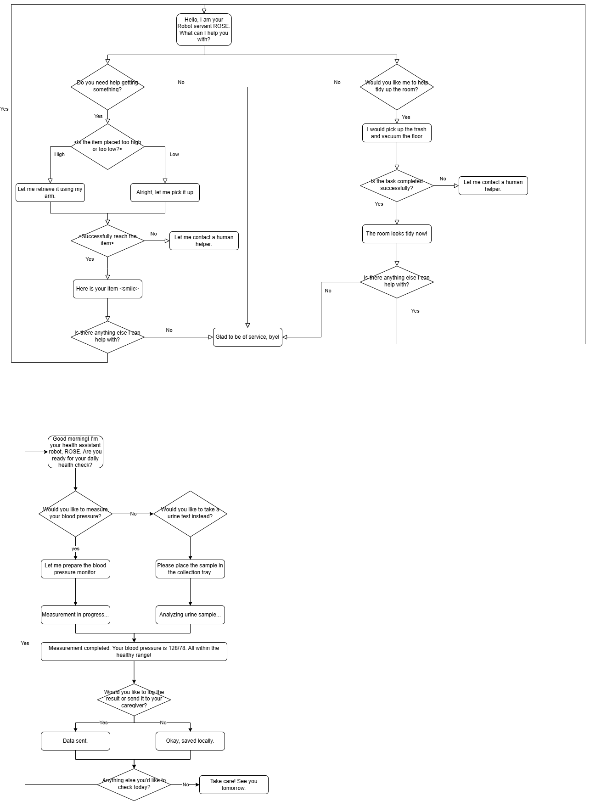

# Social Robot Design Portfolio

## About Me

| Name        | Introduction | Personal Page |
|-------------|---------------|---------------|
| Tianshu Cao | Master student in Human-Computer Interaction and Design (HCID, EIT). Studying at the University of Twente and Aalto University. Background in New Media Technology. Interested in user experience design, human-robot interaction, independent game development, and visual arts. | [CV](portfolio/Tianshu_Cao_CV.md) |

---

## Group Work

<strong> Case 1: ROSE </strong>

### Case Description
ROSE (Robot Operating System Environment) is a social robot development platform based on ROS, often using the TIAGo robot manufactured by PAL Robotics as its hardware foundation. TIAGo is a multifunctional robot that integrates a mobile base, robotic arm, elevating torso, and a variety of sensors (such as lidar, RGB-D cameras, etc.), and is widely used in research, education, and human-robot interaction fields. 

#### Existed Functions and Scenario Analysis
##### Stories/narratives in media and project data & Currently developed scenarios
Narratives/themes identified: 

(1) Intentional vs Unintentional Obstruction: A recurring narrative involves distinguishing between human behaviors that are socially intentional (e.g., trying to engage with the robot) vs unintentional (e.g., unaware obstruction).

(2) Navigation in constrained environments: Especially in healthcare settings like hospital corridors, robots face complex human-robot interaction scenarios.

(3) Social cues as interaction triggers: Stories often revolve around the robot interpreting gaze, movement hesitation, and posture as signals of human intent

Application Scenarios

(1) Logistics: ROSE delivering samples or items in hospital environments while interacting with or avoiding people.

(2) Companionship/personal assistance: Visitors engaging intentionally with the robot out of curiosity or for help.

(3) Health/nutrition advice: Potential future use cases hinted through the broader categories in the tool list.
#### Our case
Our case is to apply the ROSE robot in elderly care to accomplish three applications. These three applications are respectively: helping the elderly obtain things that are difficult to get; Keep the living environment clean and tidy. And also assist the elderly in conducting self-assessment of their own health status: such as measuring blood pressure every morning, conducting urine tests, and other behaviors.

### Selection of Useful Design Tools
#### Senario Analysis
References:

(1) Through the dual-track deduction of the best scenario and the worst scenario, break through the linear prediction model, and systematically simulate the development paths of positive and negative extremes that deviate from the long-term trend; (2) Based on the dynamic correlation analysis between key influencing factors and the goals, guide participants to independently develop differentiated future scenarios and form strategic predictions covering the possibility spectrum; (3) Taking the preset scenarios as the creative anchor points, drive participants to transform abstract variables into specific action strategies, achieving decision support from risk contingency plans to opportunity capture. This method effectively balances the rigor and innovative tension of strategic planning by structuring the imaginative space. [Busse T, Kernebeck S, Nef L, Rebacz P, Kickbusch I, Ehlers J
Views on Using Social Robots in Professional Caregiving: Content Analysis of a Scenario Method Workshop
J Med Internet Res 2021;23(11):e20046](https://www.jmir.org/2021/11/e20046/)

#### Story Boarding
References:

Through a case of medical caring team with patients, doctors and robots, we are informed that: Through the visual narrative framework, the multiple perspectives of caregivers, patients and medical staff are integrated to transform abstract needs into concrete scenarios (such as daily auxiliary scenarios), revealing the potential paths of technological intervention. The core significance lies in breaking through the limitations of traditional demand research, using co-created storyboards to stimulate participants' imagination of robot application scenarios, simultaneously capturing functional requirements and humanistic care demands, providing a decision-making basis that takes into account both practicality and emotional adaptability for technical design, and ultimately achieving a precise connection between technological innovation and real user needs. [B. Sienkiewicz, Z. Radosz-Knawa and B. Indurkhya, "A participatory design approach to using social robots for elderly care*," 2024 IEEE International Conference on Advanced Robotics and Its Social Impacts (ARSO), Hong Kong, 2024, pp. 194-199, doi: 10.1109/ARSO60199.2024.10557812.](https://ieeexplore.ieee.org/abstract/document/10557812)

#### Wizard of Oz
References:

Wizard of Oz, through the design of restricted perception experiments, simulates the perception and behavioral limitations in the real interaction scenarios of robots, enabling human experts (" guides ") to dynamically generate interaction strategies based only on the limited information available to robots. By limiting the perception range of the guide (aligning with the sensor capabilities of the robot), the non-portability of the strategy caused by the "omniscient perspective" of human experts in traditional methods is avoided, and the adaptability of the strategy to the actual capabilities of the robot is improved. The interaction behavior data collected under restricted conditions can be directly transformed into the autonomous control logic of the robot, reducing the "reality gap" in the subsequent algorithm development. [P. Sequeira et al., "Discovering social interaction strategies for robots from restricted-perception Wizard-of-Oz studies," 2016 11th ACM/IEEE International Conference on Human-Robot Interaction (HRI), Christchurch, New Zealand, 2016, pp. 197-204, doi: 10.1109/HRI.2016.7451752.](https://ieeexplore.ieee.org/abstract/document/7451752)

#### Lego Series

### Senarios
For the interaction between users and robots to be appropriate and sustainable, it is necessary to reduce the influence of uncertainty and negative emotions. Therefore, in addition to the robot's own understanding ability of semantics, it is also necessary to consider different scenarios where users have varying levels of trust in the robot.
[Miller Linda , Kraus Johannes , Babel Franziska , Baumann Martin, "More Than a Feeling—Interrelation of Trust Layers in Human-Robot Interaction and the Role of User Dispositions and State Anxiety," 2021 Vol12 Frontiers in Psychology, doi:10.3389/fpsyg.2021.592711](https://www.frontiersin.org/journals/psychology/articles/10.3389/fpsyg.2021.592711
)
#### Low user trust/low robot understanding:
70-year-old Bob was influenced by science fiction movies and believed that robots were villains who would rule the earth, so he did not trust and was afraid of robots.
Bob felt uncomfortable in his heart and sat on the sofa, holding his chest and breathing, but did not speak. The robot could not recognize the meaning of Bob's subtle movements and thought that Bob was dancing, and began to ask Bob if he needed to play music to accompany him.
Bob said sarcastically, "You are so smart", and the robot responded, "Thank you for the compliment, I will continue to work hard"

Problems with this scenario response:
The robot lacks "micro-movement" and "micro-expression" recognition, cannot understand the intention represented by human movements, lacks a model for emotional context analysis, and cannot recognize the emotions expressed by humans through voice intonation.

#### High user trust/low robot understanding:
One early morning, Grandma Zhang, as usual, used the ROSE robot for a health checkup. She voluntarily put the blood pressure monitor on her arm and said, "Little R (the robot's nickname), measure my blood pressure for me." The robot detected Grandma Zhang's action of holding the blood pressure monitor through the camera but mistakenly confused it with her daily action of "holding a water cup" (Note: The blood pressure monitor and water cup have similar shapes), and thus responded, "Sure, I'm pouring water for you." It then moved its mechanical arm to try to take the blood pressure monitor. 
Grandma Zhang was taken aback for a moment and explained with a smile, "It's not a water cup, it's for measuring blood pressure!" The robot received the keyword "blood pressure" and triggered the preset process, but failed to correctly associate it with the current situation (the arm was already wearing a blood pressure monitor). Instead, it broadcasted the blood pressure history data from last week: "Your average blood pressure last week was 125/80 mmHg." Meanwhile, the mechanical arm was still trying to grasp the blood pressure monitor, causing it to fall off. 
Grandma Zhang wasn't angry. Instead, she patiently repeated, "Little R, you haven't measured it today. You need to measure the new one first." The robot recognized the keyword "measure" again and started the default "environmental detection" mode. It scanned the room with a laser radar and reported, "The current room temperature is 26 degrees Celsius and the air quality is good." Grandma Zhang shook her head helplessly and measured her blood pressure manually. She comforted the robot, "It's okay. Try again tomorrow. You'll get it after a few more times."

Problems with this scenario response:
Weak object detail recognition: Unable to distinguish the binding strap/texture features of a blood pressure monitor from those of a water cup. 
Task chain disruption: Isolated response to the keyword "blood pressure", ignoring the coherent logic of "wearing the device - measurement - recording". 
Trust backfires: Users' excessive tolerance of errors delays the timeliness of health monitoring.

#### Low user trust/high robot understanding:
68-year-old Mary has a stubborn personality and is strongly resistant to new technology. Her daughter, who lives in another city, bought her a new type of care robot and persuaded her to use it. Mary reluctantly used the robot to monitor her daily health data, to make her daughter feel at ease.
One night, because the robot had failed to charge successfully during the day, it moved to the charging station by itself at night to try charging again. Since Mary never cared about the robot’s charging behavior, she was frightened by the moving figure in the living room when she got up at night, and fainted for a short time.
Although the robot detected the problem and called her daughter and the nearby medical center in time, and the result showed that Mary’s body was fine, she still refused to keep the robot at home again.

Problems with this scenario response: The robot can rocognize people’s emotion and other data and try to offer help. But users’trust to the robot are so low that even they share the same goal, the users still cannot accept the robot’s help as a daily routine.
### Mindmap of Problem Space

### Potential Building Blocks
Can be derived in the Mindmap

### Functional Breakdown
#### Getting items

#### Cleaning environment

#### Assising health assessment

### Potential Experimental Approach
*(To be added)*

### Pitch / Slide
*(To be added)*

---

### Expressiveness
observation of paper-puppeteering：

observation recording: https://youtu.be/jthQCp5BSxM

01
Action description: Swing left and right at a constant speed, then jump for 5 seconds and then jump in place at a very fast speed
Guess: excited

02
Action description: Hit the ground with the head at a constant speed and then swing left and right at a constant speed
Guess: The robot wants to express its needs

03
Action description: Quickly retreat in place
Guess: The robot wants to walk with me

04
Action description: The body leans to the right and maintains this action
Guess: Thinking

05
Action description: Sprint forward at a very fast speed
Guess: The emotion is hate

06
Action description: The whole body flips over, imitating a human lying on the ground, or slowly lowering the head
Guess: Sad emotion

LED:

1. Emotional expression and feedback: Express emotions by controlling the combined shape, color and flashing frequency of LED.
Application:
Blue eyes + slow flashing + smiling shape or circle - Indicates that the robot is in a calm state (no task mode), and slow blinking indicates friendly attention to humans and is ready to communicate with humans at any time
Red eyes + rapid flashing + triangle shape - When the robot detects danger and issues a warning, the eyes turn red and flash quickly to attract the user's attention

2. Health monitoring and reminders: Use LED eye changes to remind the elderly of daily health matters, such as taking medicine, drinking water, resting, etc.
Application:
Green eyes - Indicates that the elderly are in good health. When the elderly complete their daily walking goals or take medicine on time, the green eyes flash slowly to encourage
Red eyes - For example, when the elderly miss medication or bedtime, the eyes turn red and flash quickly (slower than when prompting danger signals to distinguish)

#### A tool* for expressiveness
EMO-CUE is a multimodal, low-threshold prototype expression toolbox, consisting of the following components:

##### Expressive Cue Cards

Each card represents an emotion/intention state (such as "I'm listening to you", "I need help", "I'm worried about you"), and the back of the card gives suggestions for multimodal expression combinations:

Light color changes (such as red → anxiety, blue → calm, orange → need interaction)

Vibration or tactile feedback (continuous/pulse rhythm)

Small movement patterns (head turn/backward/forward)

Voice intonation fragments (non-semantic "hmm~", "hiss~", etc.)

##### Hardware modules/low-fidelity prototypes

Use programmable Arduino or micro:bit to control small motors (express retreat), RGB lights (express state changes), and buzzers (simulate intonation).

Allow users to quickly combine and test interactive expressions by mapping cards → modules.

##### Improvisational Scenarios

Provide nursing scenario scripts, such as "elderly hesitant to take medicine", "robot notices user falls", "robot prompts relatives to call via video", etc. Participants use the EMO-CUE tool to interpret robot roles with expressive actions without using language.

---

### Design Behavior  
**Function: Helping with hard-to-reach items, cleaning, and health self-assessment**

---

####  Scenario 1: Helping Reach High or Low Items

**Dialogue**  
> "Yes, it's on the top shelf," said the elderly person.  
> The robot extended its arm, looked up to the cabinet, grasped the item carefully, and handed it to the user with a smile.

**Involved Technologies**  
- `Speech recognition`  
- `LLM + context understanding`  
- `Visual input & scene understanding`  
- `Object localisation`  
- `Vision-based grasping & manipulation`  
- `Motion planning`  
- `Human-robot interaction & gesture coordination`  
- `Affective computing (smile, polite gesture)`

---

####  Scenario 2: Keeping the Environment Clean

**Dialogue**  
> "The floor seems dusty today," the resident commented.  
> The robot activated its vacuum module, scanned the room, navigated around the furniture, and started cleaning.  
> "Done! The room is clean now," it announced.

**Involved Technologies**  
- `Speech recognition`  
- `LLM (intent understanding)`  
- `SLAM (localisation and mapping)`  
- `Path planning & obstacle avoidance`  
- `Dust detection (semantic segmentation)`  
- `Vacuum actuation control`  
- `Affective feedback (speech & tone modulation)`

---

####  Scenario 3: Measuring Blood Pressure

**Dialogue**  
> "Could you check my blood pressure, please?"  
> The robot retrieved the BP cuff, wrapped it gently around the user’s arm, initiated the measurement, and read the result aloud.

**Involved Technologies**  
- `Speech recognition`  
- `LLM (command understanding)`  
- `Manipulation & touch-sensitive actuation`  
- `Biosensor integration (BP monitor control)`  
- `Real-time data acquisition`  
- `Voice synthesis (result announcement)`  
- `Context tracking (session continuity)`

---

####  Scenario 4: Urine Test Analysis

**Dialogue**  
> "I’ve just placed the sample."  
> The robot detected the container, moved it into the analysis bay, and displayed the result on the screen: "All values normal today."

**Involved Technologies**  
- `Speech recognition & intent parsing`  
- `Object detection & classification`  
- `Grasping & manipulation (careful handling)`  
- `Lab-on-robot analysis module integration`  
- `Visual display & voice feedback`  
- `Context awareness (health logs, timestamping)`

---

####  Scenario 5: Logging and Reporting Results

**Dialogue**  
> "Please send the result to my daughter."  
> The robot encrypted the report and uploaded it securely to the connected caregiver app.

**Involved Technologies**  
- `LLM (command parsing)`  
- `User profile management`  
- `Secure data logging & transmission`  
- `Cloud integration`  
- `Role-aware access control`  
- `Affective computing (respectful tone and privacy handling)`

---

### Sustainability and ethics
Envisioning Cards are a practical design tool developed to translate complex theoretical concepts—especially from Value Sensitive Design (VSD) and Multi-lifespan Design (MLD)—into concrete actions for designers. [Yoo, Daisy and Logler, Nick and Ballard, Stephanie and Friedman, Batya, "Multi-lifespan Envisioning Cards: Journeying from Design Theory to Tools for Action,"2022, Association for Computing Machinery](https://dl.acm.org/doi/pdf/10.1145/3532106.3533495)
By applying the four aspects of the envision card: Changing Hands, Environmental Sustainability, The Long Now, Work of the Future, we can consider the ethical issues of robots and their relationship with people during the design process.

#### Changing Hands
An elderly care robot may become a family heirloom, taking care of the elderly in the family for generations. In this case, users may regard this robot as a member of the family, which means that during the design process, the robot may need to store the process of getting along with the family members, so that it can behave like the elder of the family in the process of taking care of people. At the same time, it needs to be able to transfer memory relatively easily to cope with the replacement. And the hardware is preferably modularized to facilitate the replacement of damaged parts.
If the robot is sold as a second-hand product, it also needs to protect the privacy of the original owner. This requires clearing the behavior mode set locally or encrypting the user account of the server, otherwise the information will be leaked after it is sold second-hand or stolen, threatening the personal safety of the old owner.

#### The Long Now

According to the envision cards "The Long Now", we envision a 50-year old who has interacted with the robot over a lifetime, and will continue to interact with the robot in the next few decades, with a five-year period:
At the age of 50, the robot intervenes in life as a practical tool, but not a core part of life. By the age of 55, the elderly have become accustomed to the company of the robot and begin to rely more on the robot for daily reminders and health monitoring. At the age of 60, the elderly may be highly dependent on the robot both physically and emotionally, and the family also fully trusts the robot to take care of the elderly. At the age of 70, the robot even replaces the elderly's existing interpersonal relationships to some extent, weakening personal autonomy and initiative.
The ethical concern highlighted here is that over-reliance on robots may lead to social isolation over time, weakening the connection between people and human communities.
This long-term change needs to be considered in the design stage to ensure that robots complement rather than replace the care of the elderly, and promote relationships between people rather than isolate people's social relationship.
####

####

---

## Reflections

### How is Design Research linked to HRI

Design research promotes a deep understanding of human needs, emotions, and behaviors when interacting with robots.  
Unlike traditional engineering approaches, it emphasizes user-centered iteration and real-world contextual insights, shifting robot development from functional correctness to relational effectiveness.

---

### Digital (AI) vs Embodiment

While digital AIs (e.g., chatbots) provide functional assistance, physical embodiment offers richer, multi-sensory interaction.  
Touch, movement, presence — these create emotional resonance that pure text or voice interfaces cannot replicate. Embodied robots foster trust and engagement in ways that purely digital agents struggle to achieve.

---

### Why is "HER" (not) a Compelling Argument?

After reflecting on the movie *Her*, while digital-only relationships may offer emotional attachment, the absence of physical presence limits deep bonding.  
In my view, embodiment plays a critical role in making social interaction truly fulfilling; intangible AI lacks grounding in our sensory experience of reality.

---

### Reflection: The Robot Revolution - When?

The robot revolution will accelerate when robot capabilities meaningfully enhance life quality in caregiving, companionship, and personalized assistance.  
Not just efficiency, but emotional intelligence will become the key driver for widespread social robot adoption.

---

### Reflection: The Dinosaur Hotel

The failure of the Henn na Hotel highlights the gap between robotic novelty and genuine service needs.  
Flexibility, empathy, and improvisational problem-solving — traits still dominated by humans — were missing, leading to disappointing user experiences.

---

### Reflection: Nabaztag

Nabaztag represented an early attempt at physical social interfaces.  
However, its limited interactivity and inability to evolve emotionally with users prevented it from sustaining long-term engagement, highlighting the importance of continuous emotional development in social robots.

---

### Reflection: Cuddlebits

The Cuddlebits project shows that vulnerability, subtle emotional cues, and touch responsiveness can build powerful human-robot bonds — sometimes more effectively than complex intelligence.  
It reminds designers that "less" (simpler behaviors) can often be "more" (stronger emotional connection).

---

### Reflection: Be-Right-Back

The "Be-Right-Back" concept raises serious ethical concerns.  
Simulating deceased loved ones may delay emotional healing and foster dependence on illusions.  
Despite technical feasibility, emotionally and ethically, real closure — not digital echoes — remains crucial for human well-being.

---
