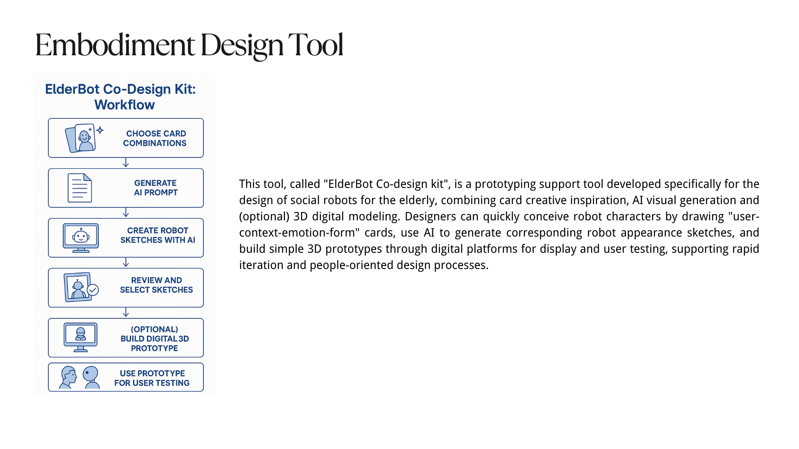
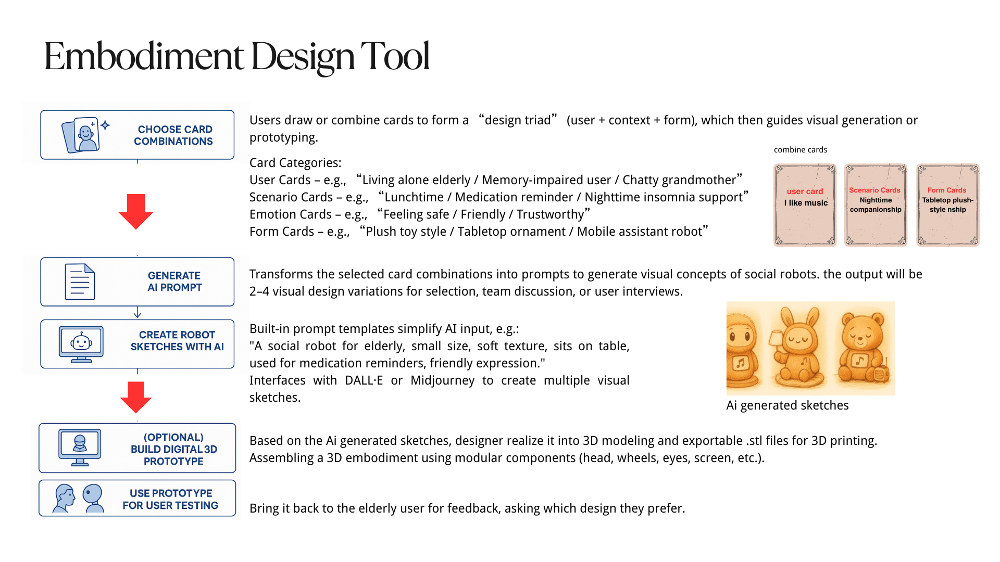

# Social Robot Design Portfolio

## About Me

| Name        | Introduction | Personal Page |
|-------------|---------------|---------------|
| Tianshu Cao | Master student in Human-Computer Interaction and Design (HCID, EIT). Studying at the University of Twente and Aalto University. Background in New Media Technology. Interested in user experience design, human-robot interaction, independent game development, and visual arts. | [CV](portfolio/Tianshu_Cao_CV.md) |

---

## Group Work

<strong> Case : ROSE </strong>

### Case Description
ROSE (Robot Operating System Environment) is a social robot development platform based on ROS, often using the TIAGo robot manufactured by PAL Robotics as its hardware foundation. TIAGo is a multifunctional robot that integrates a mobile base, robotic arm, elevating torso, and a variety of sensors (such as lidar, RGB-D cameras, etc.), and is widely used in research, education, and human-robot interaction fields. 

#### Existed Functions and Scenario Analysis
##### Stories/narratives in media and project data & Currently developed scenarios
Narratives/themes identified: 

(1) Intentional vs Unintentional Obstruction: A recurring narrative involves distinguishing between human behaviors that are socially intentional (e.g., trying to engage with the robot) vs unintentional (e.g., unaware obstruction).

(2) Navigation in constrained environments: Especially in healthcare settings like hospital corridors, robots face complex human-robot interaction scenarios.

(3) Social cues as interaction triggers: Stories often revolve around the robot interpreting gaze, movement hesitation, and posture as signals of human intent

Application Scenarios

(1) Logistics: ROSE delivering samples or items in hospital environments while interacting with or avoiding people.

(2) Companionship/personal assistance: Visitors engaging intentionally with the robot out of curiosity or for help.

(3) Health/nutrition advice: Potential future use cases hinted through the broader categories in the tool list.
#### Our case
Our case is to apply the ROSE robot in elderly care to accomplish three applications. These three applications are respectively: helping the elderly obtain things that are difficult to get; Keep the living environment clean and tidy. And also assist the elderly in conducting self-assessment of their own health status: such as measuring blood pressure every morning, conducting urine tests, and other behaviors.

---

<strong> Overview Design </strong>

### Mindmap of Problem Space

### Potential Building Blocks
#### Perception and Sensing
- Camera
- Lidar
- Microphone/Speaker
- Medical Sensors
#### Robot Mobility & Manipulation
- Arm Manipulation
- Mobile Control
#### Human-Robot Interaction
- NLP
- Touchscreen interface
#### Alert System
#### System integration

### Functional Breakdown
#### Assist in Retrieving Objects
- Environment Perception and Object detection
- Understand Human Commands
- Navigation
- Manipulate and Retrieve object
- Deliver Object to Elderly

#### Maintain clean and tidy environment
- Detect Mess / Dirt / Items Out of Place
- Plan Cleaning or Tidy Task
- Simple Manipulations
- Navigation

#### Support Daily Health Self-Assessment
- Prompt and Guide Elderly
- Integrate with Medical Devices
- Record and Analyze Results
- Communicate with Caregiver if Needed

### Potential Experimental approach
#### Verify that robot can complete tasks autonomously
#### Evaluate naturalness, trust, and ease of use
#### Observe learning curve and routine integration

| Aspect                | Metric/Tool                            |
| --------------------- | -------------------------------------- |
| Task performance      | Task success rate, time, failure modes |
| HRI usability         | SUS, NASA TLX, interaction steps       |
| Trust & acceptance    | Almere Model Questionnaire             |
| Speech recognition    | Command success rate, retry frequency  |
| Grasping accuracy     | Grasp success rate, misplacement rate  |
| System robustness     | Downtime, recovery from error          |
| Data privacy handling | Consent protocol, encryption logs      |

### Pitch / Slide

---

<strong> Selection of Useful Design Tools </strong>

  
#### Senario Analysis
References:

(1) Through the dual-track deduction of the best scenario and the worst scenario, break through the linear prediction model, and systematically simulate the development paths of positive and negative extremes that deviate from the long-term trend; (2) Based on the dynamic correlation analysis between key influencing factors and the goals, guide participants to independently develop differentiated future scenarios and form strategic predictions covering the possibility spectrum; (3) Taking the preset scenarios as the creative anchor points, drive participants to transform abstract variables into specific action strategies, achieving decision support from risk contingency plans to opportunity capture. This method effectively balances the rigor and innovative tension of strategic planning by structuring the imaginative space. [Busse T, Kernebeck S, Nef L, Rebacz P, Kickbusch I, Ehlers J
Views on Using Social Robots in Professional Caregiving: Content Analysis of a Scenario Method Workshop
J Med Internet Res 2021;23(11):e20046](https://www.jmir.org/2021/11/e20046/)

#### Story Boarding
References:

Through a case of medical caring team with patients, doctors and robots, we are informed that: Through the visual narrative framework, the multiple perspectives of caregivers, patients and medical staff are integrated to transform abstract needs into concrete scenarios (such as daily auxiliary scenarios), revealing the potential paths of technological intervention. The core significance lies in breaking through the limitations of traditional demand research, using co-created storyboards to stimulate participants' imagination of robot application scenarios, simultaneously capturing functional requirements and humanistic care demands, providing a decision-making basis that takes into account both practicality and emotional adaptability for technical design, and ultimately achieving a precise connection between technological innovation and real user needs. [B. Sienkiewicz, Z. Radosz-Knawa and B. Indurkhya, "A participatory design approach to using social robots for elderly care*," 2024 IEEE International Conference on Advanced Robotics and Its Social Impacts (ARSO), Hong Kong, 2024, pp. 194-199, doi: 10.1109/ARSO60199.2024.10557812.](https://ieeexplore.ieee.org/abstract/document/10557812)

#### Wizard of Oz
References:

Wizard of Oz, through the design of restricted perception experiments, simulates the perception and behavioral limitations in the real interaction scenarios of robots, enabling human experts (" guides ") to dynamically generate interaction strategies based only on the limited information available to robots. By limiting the perception range of the guide (aligning with the sensor capabilities of the robot), the non-portability of the strategy caused by the "omniscient perspective" of human experts in traditional methods is avoided, and the adaptability of the strategy to the actual capabilities of the robot is improved. The interaction behavior data collected under restricted conditions can be directly transformed into the autonomous control logic of the robot, reducing the "reality gap" in the subsequent algorithm development. [P. Sequeira et al., "Discovering social interaction strategies for robots from restricted-perception Wizard-of-Oz studies," 2016 11th ACM/IEEE International Conference on Human-Robot Interaction (HRI), Christchurch, New Zealand, 2016, pp. 197-204, doi: 10.1109/HRI.2016.7451752.](https://ieeexplore.ieee.org/abstract/document/7451752)

#### Lego Series

---

<strong> Scenarios </strong>

For the interaction between users and robots to be appropriate and sustainable, it is necessary to reduce the influence of uncertainty and negative emotions. Therefore, in addition to the robot's own understanding ability of semantics, it is also necessary to consider different scenarios where users have varying levels of trust in the robot.
[Miller Linda , Kraus Johannes , Babel Franziska , Baumann Martin, "More Than a Feeling—Interrelation of Trust Layers in Human-Robot Interaction and the Role of User Dispositions and State Anxiety," 2021 Vol12 Frontiers in Psychology, doi:10.3389/fpsyg.2021.592711](https://www.frontiersin.org/journals/psychology/articles/10.3389/fpsyg.2021.592711
)
#### Low user trust/low robot understanding:
70-year-old Bob was influenced by science fiction movies and believed that robots were villains who would rule the earth, so he did not trust and was afraid of robots.
Bob felt uncomfortable in his heart and sat on the sofa, holding his chest and breathing, but did not speak. The robot could not recognize the meaning of Bob's subtle movements and thought that Bob was dancing, and began to ask Bob if he needed to play music to accompany him.
Bob said sarcastically, "You are so smart", and the robot responded, "Thank you for the compliment, I will continue to work hard"

Problems with this scenario response:
The robot lacks "micro-movement" and "micro-expression" recognition, cannot understand the intention represented by human movements, lacks a model for emotional context analysis, and cannot recognize the emotions expressed by humans through voice intonation.

#### High user trust/low robot understanding:
One early morning, Grandma Zhang, as usual, used the ROSE robot for a health checkup. She voluntarily put the blood pressure monitor on her arm and said, "Little R (the robot's nickname), measure my blood pressure for me." The robot detected Grandma Zhang's action of holding the blood pressure monitor through the camera but mistakenly confused it with her daily action of "holding a water cup" (Note: The blood pressure monitor and water cup have similar shapes), and thus responded, "Sure, I'm pouring water for you." It then moved its mechanical arm to try to take the blood pressure monitor. 
Grandma Zhang was taken aback for a moment and explained with a smile, "It's not a water cup, it's for measuring blood pressure!" The robot received the keyword "blood pressure" and triggered the preset process, but failed to correctly associate it with the current situation (the arm was already wearing a blood pressure monitor). Instead, it broadcasted the blood pressure history data from last week: "Your average blood pressure last week was 125/80 mmHg." Meanwhile, the mechanical arm was still trying to grasp the blood pressure monitor, causing it to fall off. 
Grandma Zhang wasn't angry. Instead, she patiently repeated, "Little R, you haven't measured it today. You need to measure the new one first." The robot recognized the keyword "measure" again and started the default "environmental detection" mode. It scanned the room with a laser radar and reported, "The current room temperature is 26 degrees Celsius and the air quality is good." Grandma Zhang shook her head helplessly and measured her blood pressure manually. She comforted the robot, "It's okay. Try again tomorrow. You'll get it after a few more times."

Problems with this scenario response:
Weak object detail recognition: Unable to distinguish the binding strap/texture features of a blood pressure monitor from those of a water cup. 
Task chain disruption: Isolated response to the keyword "blood pressure", ignoring the coherent logic of "wearing the device - measurement - recording". 
Trust backfires: Users' excessive tolerance of errors delays the timeliness of health monitoring.

#### Low user trust/high robot understanding:
68-year-old Mary has a stubborn personality and is strongly resistant to new technology. Her daughter, who lives in another city, bought her a new type of care robot and persuaded her to use it. Mary reluctantly used the robot to monitor her daily health data, to make her daughter feel at ease.
One night, because the robot had failed to charge successfully during the day, it moved to the charging station by itself at night to try charging again. Since Mary never cared about the robot’s charging behavior, she was frightened by the moving figure in the living room when she got up at night, and fainted for a short time.
Although the robot detected the problem and called her daughter and the nearby medical center in time, and the result showed that Mary’s body was fine, she still refused to keep the robot at home again.

Problems with this scenario response: The robot can rocognize people’s emotion and other data and try to offer help. But users’trust to the robot are so low that even they share the same goal, the users still cannot accept the robot’s help as a daily routine.

#### Result
The Trust × Understanding Matrix reveals key problems in user–robot interaction. Low trust and low understanding cause fear and miscommunication, as seen with Bob. High trust and low understanding lead to user tolerance but task failure, like with Grandma Zhang. Low trust and high understanding, as with Mary, turn helpful actions into perceived threats. Only high trust and high understanding create smooth interaction. The method helps spot these mismatches and guides design fixes like better emotion detection, task logic, and transparent robot behavior.

---

<strong> Expressiveness </strong>

observation of paper-puppeteering：

observation recording: https://youtu.be/jthQCp5BSxM

01
Action description: Swing left and right at a constant speed, then jump for 5 seconds and then jump in place at a very fast speed
Guess: excited

02
Action description: Hit the ground with the head at a constant speed and then swing left and right at a constant speed
Guess: The robot wants to express its needs

03
Action description: Quickly retreat in place
Guess: The robot wants to walk with me

04
Action description: The body leans to the right and maintains this action
Guess: Thinking

05
Action description: Sprint forward at a very fast speed
Guess: The emotion is hate

06
Action description: The whole body flips over, imitating a human lying on the ground, or slowly lowering the head
Guess: Sad emotion

LED:

1. Emotional expression and feedback: Express emotions by controlling the combined shape, color and flashing frequency of LED.
Application:
Blue eyes + slow flashing + smiling shape or circle - Indicates that the robot is in a calm state (no task mode), and slow blinking indicates friendly attention to humans and is ready to communicate with humans at any time
Red eyes + rapid flashing + triangle shape - When the robot detects danger and issues a warning, the eyes turn red and flash quickly to attract the user's attention

2. Health monitoring and reminders: Use LED eye changes to remind the elderly of daily health matters, such as taking medicine, drinking water, resting, etc.
Application:
Green eyes - Indicates that the elderly are in good health. When the elderly complete their daily walking goals or take medicine on time, the green eyes flash slowly to encourage
Red eyes - For example, when the elderly miss medication or bedtime, the eyes turn red and flash quickly (slower than when prompting danger signals to distinguish)

#### A tool* for expressiveness
EMO-CUE is a multimodal, low-threshold prototype expression toolbox, consisting of the following components:

##### Expressive Cue Cards

Each card represents an emotion/intention state (such as "I'm listening to you", "I need help", "I'm worried about you"), and the back of the card gives suggestions for multimodal expression combinations:

Light color changes (such as red → anxiety, blue → calm, orange → need interaction)

Vibration or tactile feedback (continuous/pulse rhythm)

Small movement patterns (head turn/backward/forward)

Voice intonation fragments (non-semantic "hmm~", "hiss~", etc.)

##### Hardware modules/low-fidelity prototypes

Use programmable Arduino or micro:bit to control small motors (express retreat), RGB lights (express state changes), and buzzers (simulate intonation).

Allow users to quickly combine and test interactive expressions by mapping cards → modules.

##### Improvisational Scenarios

Provide nursing scenario scripts, such as "elderly hesitant to take medicine", "robot notices user falls", "robot prompts relatives to call via video", etc. Participants use the EMO-CUE tool to interpret robot roles with expressive actions without using language.

---

<strong> Embodiment </strong>

---

<strong>  Design Behavior   </strong>

**Function: Helping with hard-to-reach items, cleaning, and health self-assessment**

---

####  Scenario 1: Helping Reach High or Low Items

**Dialogue**  
> "Yes, it's on the top shelf," said the elderly person.  
> The robot extended its arm, looked up to the cabinet, grasped the item carefully, and handed it to the user with a smile.

**Involved Technologies**  
- `Speech recognition`  
- `LLM + context understanding`  
- `Visual input & scene understanding`  
- `Object localisation`  
- `Vision-based grasping & manipulation`  
- `Motion planning`  
- `Human-robot interaction & gesture coordination`  
- `Affective computing (smile, polite gesture)`

---

####  Scenario 2: Keeping the Environment Clean

**Dialogue**  
> "The floor seems dusty today," the resident commented.  
> The robot activated its vacuum module, scanned the room, navigated around the furniture, and started cleaning.  
> "Done! The room is clean now," it announced.

**Involved Technologies**  
- `Speech recognition`  
- `LLM (intent understanding)`  
- `SLAM (localisation and mapping)`  
- `Path planning & obstacle avoidance`  
- `Dust detection (semantic segmentation)`  
- `Vacuum actuation control`  
- `Affective feedback (speech & tone modulation)`

---

####  Scenario 3: Measuring Blood Pressure

**Dialogue**  
> "Could you check my blood pressure, please?"  
> The robot retrieved the BP cuff, wrapped it gently around the user’s arm, initiated the measurement, and read the result aloud.

**Involved Technologies**  
- `Speech recognition`  
- `LLM (command understanding)`  
- `Manipulation & touch-sensitive actuation`  
- `Biosensor integration (BP monitor control)`  
- `Real-time data acquisition`  
- `Voice synthesis (result announcement)`  
- `Context tracking (session continuity)`

---

####  Scenario 4: Urine Test Analysis

**Dialogue**  
> "I’ve just placed the sample."  
> The robot detected the container, moved it into the analysis bay, and displayed the result on the screen: "All values normal today."

**Involved Technologies**  
- `Speech recognition & intent parsing`  
- `Object detection & classification`  
- `Grasping & manipulation (careful handling)`  
- `Lab-on-robot analysis module integration`  
- `Visual display & voice feedback`  
- `Context awareness (health logs, timestamping)`

---

####  Scenario 5: Logging and Reporting Results

**Dialogue**  
> "Please send the result to my daughter."  
> The robot encrypted the report and uploaded it securely to the connected caregiver app.

**Involved Technologies**  
- `LLM (command parsing)`  
- `User profile management`  
- `Secure data logging & transmission`  
- `Cloud integration`  
- `Role-aware access control`  
- `Affective computing (respectful tone and privacy handling)`

### Result
The tool helped design five clear care scenarios for the ROSE robot. Each one shows a daily task with short dialogue and needed technologies. Tasks include reaching items, cleaning, health checks, and sharing results. The method links user intent to robot actions. It highlights key tech like speech, vision, and safe touch. It also shows the need for context, emotion, and privacy. This supports clear, human-friendly robot design.

---

<strong> Sustainability and ethics </strong>

Envisioning Cards are a practical design tool developed to translate complex theoretical concepts—especially from Value Sensitive Design (VSD) and Multi-lifespan Design (MLD)—into concrete actions for designers. [Yoo, Daisy and Logler, Nick and Ballard, Stephanie and Friedman, Batya, "Multi-lifespan Envisioning Cards: Journeying from Design Theory to Tools for Action,"2022, Association for Computing Machinery](https://dl.acm.org/doi/pdf/10.1145/3532106.3533495)
By applying the four aspects of the envision card: Changing Hands, Environmental Sustainability, The Long Now, Work of the Future, we can consider the ethical issues of robots and their relationship with people during the design process.

#### Changing Hands
An elderly care robot may become a family heirloom, taking care of the elderly in the family for generations. In this case, users may regard this robot as a member of the family, which means that during the design process, the robot may need to store the process of getting along with the family members, so that it can behave like the elder of the family in the process of taking care of people. At the same time, it needs to be able to transfer memory relatively easily to cope with the replacement. And the hardware is preferably modularized to facilitate the replacement of damaged parts.
If the robot is sold as a second-hand product, it also needs to protect the privacy of the original owner. This requires clearing the behavior mode set locally or encrypting the user account of the server, otherwise the information will be leaked after it is sold second-hand or stolen, threatening the personal safety of the old owner.

#### The Long Now

According to the envision cards "The Long Now", we envision a 50-year old who has interacted with the robot over a lifetime, and will continue to interact with the robot in the next few decades, with a five-year period:
At the age of 50, the robot intervenes in life as a practical tool, but not a core part of life. By the age of 55, the elderly have become accustomed to the company of the robot and begin to rely more on the robot for daily reminders and health monitoring. At the age of 60, the elderly may be highly dependent on the robot both physically and emotionally, and the family also fully trusts the robot to take care of the elderly. At the age of 70, the robot even replaces the elderly's existing interpersonal relationships to some extent, weakening personal autonomy and initiative.
The ethical concern highlighted here is that over-reliance on robots may lead to social isolation over time, weakening the connection between people and human communities.
This long-term change needs to be considered in the design stage to ensure that robots complement rather than replace the care of the elderly, and promote relationships between people rather than isolate people's social relationship.

### Result
The Envisioning Cards tool helped us reflect on long-term robot use. “Changing Hands” shows the need for memory transfer, modular design, and privacy when ownership changes. “The Long Now” warns against over-reliance and social isolation. These cards guide designers to protect users, plan for time, and support human relationships.

## Reflections

### How is Design Research linked to HRI

Chapter 8 says design research can connect with HRI in these ways: Research through Design means using prototypes to explore how people feel, trust, and interact with social robots. Participatory Design invites possible users to help design the robot’s shape, behavior, and feedback. This can help make the robot more like what users want. These methods all focus on human-centered thinking and give practical ways to study HRI.

---

### Digital (AI) vs Embodiment

Even though people today can interact well with simple square devices, Chapter 9 says: actuators are not always needed. Voice, emojis, and haptic feedback can already create a social feeling. Smartphones can be social because they have sensors (like camera and microphone) and smart voice assistants. These small “embodied” features help blur the line between device and person in experience.

---

### Why is "HER" (not) a Compelling Argument?

In Her, the main character builds a deep emotional connection with the AI assistant just by talking. This shows that social interaction depends on language, empathy, and response—not physical form. So Her shows that even without actuators, an AI can still be a “social robot.” This makes us think again: maybe embodiment is not necessary, but just a way to make the experience better.

---

### Reflection: The Robot Revolution - When?

Compared to the positive predictions by Bar-Cohen and others, real robot development is still far from a “revolution.” The main reasons are: Technology is still slow, especially in human-robot teamwork, natural language, and emotion understanding. Real needs are different from the ideal plan. In real life, invisible automation is more common in industry and logistics, not human-like robots. So the robot revolution is still moving slowly, and real social use is still far away.

---

### Reflection: The Dinosaur Hotel

The problem of the Dinosaur Hotel is: the robot service was too simple. It only did basic front desk work and had no cultural meaning or deep interaction. Compared to hotels like CitizenM that use smart automation with human help, the robot hotel failed to make a good service system. The key to success is not “how complex the robot is,” but whether it can build a low-cost and meaningful service experience.

---

### Reflection: Nabaztag

Nabaztag was a social interface for the Internet of Things. Its good point was trying to give internet functions a body and a personality. But it had no clear useful purpose and weak social features. It was just a “cute toy.” It failed because the interaction was too shallow, personality not strong, and content too weak. Users lost interest fast. This shows that social robots can’t just be cute in appearance. They also need better function and user experience.

---

### Reflection: Cuddlebits

The Cuddlebits project focused on using small movements and soft looks to build emotional connection. It also used long-term interaction to understand the “social gap” between human and robot. This shows that design research is not just about looks. It is also about using everyday experience to test and improve emotional design.

---

### Reflection: How can you classify stories about robots/AI?

First, I will classify them by story type. By looking at famous series or films, we can make examples like:
    Science fiction (like I, Robot): talks about future technology and how it affects human society;
    Horror (like Black Mirror): shows fear from technology that goes out of control;
    Drama (like Robot & Frank): focuses on relationships and growth between human and AI;
    Romance (like Her): shows how humans may build emotional connection with AI (even though it seems to end badly!).

For the ethics side, we can also divide stories by positive or negative endings, like:
    AI/robots help humans and live in harmony;
    AI fights back or humans lose control and disasters happen;
    Or even give a vague ending: raising moral questions but not giving a clear answer, letting the audience think for themselves.
    This kind of classification helps us understand how humans "practice" possible futures with robots in stories.

---

### Reflection: What is the difference between Johnson’s science fiction prototyping and traditional scenario-based design?

Johnson’s Science Fiction Prototyping (SFP) is a method that uses made-up stories to explore the future of technology. Its features are:
    Story comes first, and it focuses on how technology may affect society, ethics, and human emotions; The stories usually have full characters, situations, and background, so readers can understand future tech from the “user’s view”; It cares more about “emotional connection” than “technical possibility.”
But traditional Scenario-based Design, like Stanford explained, focuses more on: Making use situations based on user needs; Solving real problems clearly, with step-by-step logic; It cares more about system and usability.
The main difference is:
In SFP, the robot is more like a character in the story, helping the plot move. However in scenario-based design, the robot is a function tool, to help users reach a goal.

---

### Reflection: How did the 21st Century Robot project create a NAO-like personality? How did the story evolve?

This project changed step by step from idea to final product. The process can be divided into:
    Idea stage: Johnson imagined a robot platform where users can co-create the personality and story. This supports personal creativity. Technology limitation stage: Because of real-life limits (like voice recognition and emotion modeling), the design became simpler, and moved to a NAO-like robot that is easy to control and works stably. Product integration stage: To enter the market and education field, the robot finally used a standard shape and only a small “human-like” personality. It became a “predictable” and neutral social robot.

If the story wanted to “go further,” it may need: A more open programming system (so users can really build a special personality); Better multi-modal interaction (like gesture and emotion recognition); A stronger story background (for example, a robot that grows up with family members).

---

### Reflection: What kind of stories are told to customers when selling products? How are they different from reality?

The stories used in product selling usually focus on emotional connection between human and product, like “grow up with your child,” or “take care of older family. They also use clear scenes (home, school, hospital) so customers can “imagine” how to use the product. They make users feel they are buying “a friend with a soul,” not just a machine.
But to sell better, they sometimes skip real limits, like errors in voice recognition or low emotion detection accuracy. The goal of these stories is not to show technical truth, but to touch the customer’s feelings, so they will accept and buy. These stories are often different from real use, but this is a planned strategy in storytelling.

---

### Reflection: What storytelling elements should be considered when designing social robots? Is uncanny valley related to story?

When designing social robots, the following story elements should be carefully considered:
    User’s story expectation: for example, children may want robots with fairy tale traits, while older people may want family-style support.
    Background setting: where does the robot come from? Why is it here with the user? This helps users accept the robot.
    Development path: can the robot grow with the user, make memories? A growing story increases user involvement.
Uncanny Valley is connected to story. If the designer wants users to feel “awe,” “doubt,” or “distance,” then using a mysterious and unclear story background can make this stronger.
But if the goal is to make the robot “cute” or “natural,” then a warm and relaxed story can reduce the strange feeling.

---

### Reflection: The paper by Ju&Hoffmann (Design with motion in mind) is a very good source on using motion in your design(process). Which lessons would apply to your case?

The article by Ju and Hoffmann says that when we design robot motion, we should not only think about whether the action is technically possible, but also think about how people will “feel” or “see” that action. For our elder care robot, some lessons are especially useful. First, the robot’s movement should be soft and slow. Elderly people may feel scared or nervous if the robot moves too fast or too suddenly. So the movement needs to feel safe and predictable. Second, motion should express intention. For example, when the robot stretches out its arm, it may not be trying to grab something, but showing “I want to help you” or “please follow me.” Third, motion should be part of communication. Small gestures like nodding, turning the head, or slightly turning the body can make the robot feel more like an intentional being to the elderly.

---

### Reflection: An often used tool for analysis of motion is the Laban Framework. can you give some good sources where it is applied to HRI, but (more importantly) can you also find one or two alternatives? (So, the question here is why 'Robot Motion' + 'Theatre' = Laban seems to be the main route)

The Laban movement analysis framework was first used in dance and theatre. It helps people describe and understand motion using space, force, and timing. It is used in robots because it gives a structured way to make robot movements look emotional and purposeful, like how actors perform. But it also has limits, because it is too focused on human-like movement. Some alternatives are: first, Kansei Engineering. It designs based on how humans feel things, like “comfortable” or “friendly.” This fits elder care robots. Second, Expressive Motion Planning. It starts from what the robot can do, and lets the motion express feelings while still doing real tasks. It does not try to look like a human, but focuses on making movement meaningful.

---

### Reflection: Reflect on the following statement: To design a social robot and its communication we might need to take into account the way people parse behaviours and not necessarily replicate one-o-one human-like behaviour. Every robot can be interpreted as social if it displays animacy, agency (intentional behavior); which method would you use to design movement to achieve intentionality without relying on behaviours modelled on human behaviour?

To make a robot look like it has intention, it doesn’t have to move like a human. We can try different ideas. First, use special robot parts. For example, a screen can show symbols or animations to express ideas, like a heart to show care. A metal arm can point or welcome someone by changing its angle or direction. Second, make a clear “cause–action–result” chain. If the robot sees that an elder has fallen, it leans forward, lights up, and speaks. This clear reaction makes people think it has purpose. Third, use rhythm and repetition. People often think something is alive if it repeats movement. So if the robot moves with a little rhythm and repetition, it looks more like it has a mind.

---

### Reflection: So far we have focussed mainly on motion as a means for expression. Can you find fundamental insights (such as the Laban framework for motion) that gives you a starting point for sound design? or haptics? or morphology?

We can think from haptics. For elder care robots, touch is very important. First, older people may not see or hear well, but they can still feel touch. So good haptic design can improve interaction. Second, haptics can express emotion. A soft vibration can mean a light pat on the shoulder. A gentle warm surface can mean comfort. Third, haptics can guide action. A soft pull on the hand can tell the elder to lift their hand or stand up. This shows that we don’t need only visual or audio cues to communicate. We can also build trust and emotion through touch.

---

### Reflection: If a large part of the design work seems to evolve around making robots sociable, what would the design space of a (deliberately) anti-social robot look like?

If we want to design an “anti-social robot,” we first need to think about the situation. Anti-social does not mean bad. It may be useful in special places. First, in warning or reminder scenes. For example, in a hospital, it can remind patients to return to their room. It doesn’t need to be kind, but firm. Second, security robots. At night, they patrol and don’t talk too much with people. Keeping a distance can be better. Third, automatic managers. Like in a library or lab, it just helps keep order. It can be designed to look cold or neutral on purpose. Compared to normal social robots, anti-social robots may look simpler, without facial expressions, so people don’t feel emotional connection. Its movement is fast and efficient, not friendly. It doesn’t start a conversation but only reacts when needed. This shows that being “not social” is also a design style, depending on the context.

---

### Reflection: is the discussion on embodied agents v.s. virtual agents still a relevant form? Can you find other (hybrid) shapes too?

This discussion is still meaningful now. In different use situations, people have different feelings about “real” or “virtual.” For example, in elder care, a real robot can give more safety and company feelings, but a virtual assistant, though convenient, may not build real trust and dependence. There are also some hybrid examples. For example, some robots have a physical body, but the face and speech come from a screen with a virtual character. Or some virtual agents work together with smart home devices and use lights or sounds to show “they are present.” These show that real and virtual are not always opposite. We can mix them depending on the target group and environment.

---

### Reflection: Can you find insights or work on dealing in a structured way with the robotic capabilities and social aspects of the design? Are they the same? Could you formulate requirements for social interaction in a similar (structural) way as 'normal' engineering requirements are formulated?

Some research tries to write “social ability” in a structured way. For example, we can divide social design into perception, expression, and regulation. Each part can have its own “subsystem.” We can write clear interaction needs like “robot must respond in 3 seconds,” or “gesture must match the speech,” or “robot should start small talk every 10 minutes.” These methods show we can write “social requirements” just like we write technical ones. For example, “greet softly when user comes close,” or “give emotional feedback when user is quiet for a long time.” So social and technical needs are not the same, but we can use a similar way to design both.

---

### Reflection:Can you find examples where there is a clear conflict in design aspects that come from 'function defines form' and from social requirements? Can you come up with a design that has a very good match?

Yes. For example, in hospitals, care robots face a conflict. From function side, they should be small, fast, and accurate. But from social side, if they look too mechanical or cold, patients feel uncomfortable. If we design for tools, they look “unfriendly.” If we design for emotions, they may lose function. A good example is Paro the seal robot. Its function is simple (emotional support), so all design can focus on being social. It uses soft cover, slow motion, and quiet voice to build emotional connection. For our elder care robot, we can design it like this: stable body, round edges, warm colors. The hand can be metal for function, but covered by soft removable layer. Its speech and motion should be slow, clear, and non-threatening. This can balance both function and social needs.

---

### Reflection: Duffy (see below) formulated a nice reference list of aspects relevant for design of embodiment. Which of these are the most relevant for your case?

Duffy listed many things like presence, expressivity, social role, body structure, and interaction adaptability. For our elder care robot, some are most important. First, expressivity. Elders understand more through body motion, so actions should be clear and with rhythm. Second, social role. The robot should be a “helper” or “companion,” not too strict or cold. Third, presence. The robot should have a clear position and space reaction, so people feel “it is here,” not just a voice. Fourth, adaptability. The robot should react to different elder states, like being okay with slow speech or weak actions. These points help us build a robot that is not only useful, but also trusted and accepted.

---
